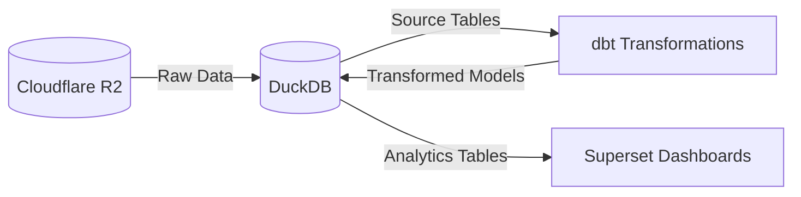
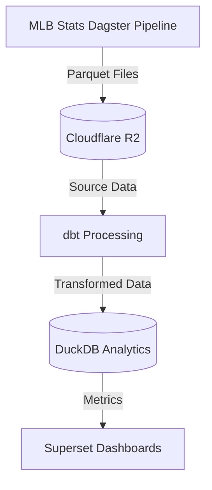
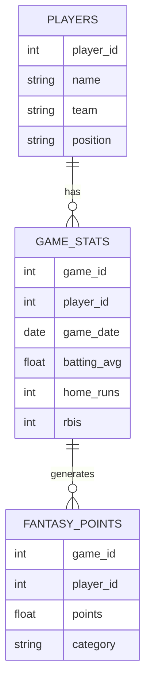

# MLB Stats & Fantasy Baseball Analytics

<div align="center">

[](https://www.python.org/)
[](https://superset.apache.org/)
[](https://duckdb.org/)
[](LICENSE)

A modern data analytics platform combining MLB statistics with fantasy baseball insights.

[Getting Started](#getting-started) •
[Architecture](#architecture) •
[Documentation](#documentation) •
[Contributing](#contributing)

</div>

---

## 🚀 Getting Started

### Prerequisites

- Docker and Docker Compose
- Python 3.9+
- Make (optional, but recommended)
- Cloudflare R2 bucket populated with MLB stats data (see [MLB Stats Pipeline](#mlb-stats-pipeline) below)

### MLB Stats Pipeline

Before running this project, you need to populate your Cloudflare R2 bucket with MLB statistics data using the [MLB Stats Dagster Pipeline](https://github.com/waaronmorris/mlb-stats-dagster):

1. Clone and set up the MLB Stats Pipeline:
   ```bash
   git clone https://github.com/waaronmorris/mlb_stats_dagster.git
   cd mlb_stats_dagster
   ```

2. Configure the pipeline:
   ```bash
   cp .env.example .env
   # Edit .env with your Cloudflare R2 credentials and MLB season configuration
   ```

3. Start the pipeline using Docker Compose:
   ```bash
   docker-compose up -d
   ```

4. Access the Dagster UI at `http://localhost:3000` and run the pipeline to populate your R2 bucket with MLB statistics data.

5. Once the pipeline has completed and your R2 bucket contains the MLB stats data, return here to continue setup.

### Quick Start

1. Clone the repository:
   ```bash
   git clone https://github.com/yourusername/mlb-stats.git
   cd mlb-stats
   ```

2. Set up environment:
   ```bash
   cp env/.env.default env/.env
   # Edit env/.env with your configuration including:
   # - CLOUDFLARE_R2_ACCESS_KEY
   # - CLOUDFLARE_R2_SECRET_KEY
   # - CLOUDFLARE_R2_BUCKET_NAME
   ln -s env/.env .env
   ```

3. Start services:
   ```bash
   docker-compose up -d
   ```

4. Access Superset at `http://localhost:8088`

## 🏗 Architecture

### Data Flow


### ETL Process


The ETL pipeline consists of several key stages, with initial data loading occurring during container build:

1. **MLB Stats Dagster Pipeline**
   - External pipeline that provides structured Parquet files
   - Data is uploaded to Cloudflare R2
   - Initial data is loaded during container build

2. **Data Processing (dbt)**
   - **Sources**: Direct mappings to R2 Parquet files
   - **Staging**: Cleaned and standardized data models
   - **Intermediate**: Core business logic and relationships
   - **Marts**: Analytics-ready aggregated tables

3. **Data Loading**
   - Transformed data loaded into DuckDB analytics tables
   - Optimized for query performance with appropriate indexes
   - Partitioned by season and update frequency

4. **Data Consumption**
   - Superset dashboards for visualization
   - Interactive analytics queries
   - Performance-optimized views

Key Features:
- MLB Stats Dagster pipeline for data ingestion
- Centralized R2 storage
- Data quality checks at ingestion
- Full data lineage tracking
- Automated recovery procedures
- Performance optimization through partitioning

### Data Model


## 🛠 Tech Stack

- **Data Storage**
  - Cloudflare R2: Object storage for raw data
  - DuckDB: High-performance analytics database
  - PostgreSQL: Metadata and user management

- **Processing & Analytics**
  - dbt: Data transformation
  - Apache Superset: Visualization and dashboards
  - Redis: Caching and queue management

- **Infrastructure**
  - Docker: Containerization
  - Make: Development automation

## 📁 Project Structure

```
.
├── env/                    # Environment configuration
│   ├── .env.default       # Default environment variables
│   ├── .env.schema        # Environment variables documentation
│   └── README.md          # Environment setup guide
├── docker/                # Docker configuration files
├── superset/              # Superset configuration and dashboards
├── dbt/                   # Data transformation models
├── scripts/               # Utility scripts
├── docker-compose.yml     # Service definitions
├── Makefile              # Development commands
└── README.md             # This file
```

## 🔧 Development

Common development tasks are automated through the Makefile:

```bash
make up              # Start all services
make down            # Stop all services
make logs            # View logs
make test            # Run tests
make clean           # Clean up containers and volumes
```

## 📚 Documentation

- [Environment Configuration](env/README.md)
- [API Documentation](docs/api.md)
- [Data Model](docs/data-model.md)
- [Contributing Guide](CONTRIBUTING.md)

## 🤝 Contributing

1. Fork the repository
2. Create your feature branch (`git checkout -b feature/amazing-feature`)
3. Commit your changes (`git commit -m 'Add amazing feature'`)
4. Push to the branch (`git push origin feature/amazing-feature`)
5. Open a Pull Request

## 📜 License

This project is licensed under the MIT License - see the [LICENSE](LICENSE) file for details.

## 🙏 Acknowledgments

- MLB Stats API for providing baseball statistics
- Apache Superset community
- DuckDB team

## 💬 Support

For support, please [open an issue](https://github.com/yourusername/mlb-stats/issues) or contact the maintainers. 
